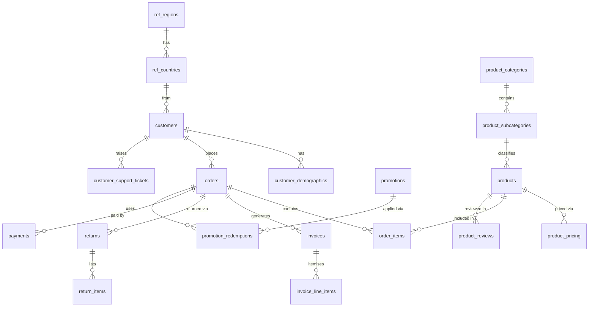

# DQ_UC_Ontology — Databricks Data Governance & Quality Demo

A full-stack Databricks demonstration of **data governance**, **data quality**, and **ontology-driven analytics** built on a synthetic global online retail dataset. The solution spans the complete Databricks data platform: Lakeflow Spark Declarative Pipelines (SDP), Unity Catalog governance, metric views, and Genie One natural language analytics.

Deployable to **any Databricks workspace** — no hardcoded workspace URLs or IDs. Configure once in `databricks.local.yml` (gitignored) and run five bundle jobs to stand up the full demo.

---

## Contents

- [The Business Story](#the-business-story)
- [Architecture Overview](#architecture-overview)
- [Data Model](#data-model)
- [Pipeline — Bronze → Silver → Gold](#pipeline--bronze--silver--gold)
- [Data Quality Framework](#data-quality-framework)
- [Unity Catalog Governance](#unity-catalog-governance)
- [Metric Views — Semantic Layer](#metric-views--semantic-layer)
- [Genie One Setup](#genie-one-setup)
- [Deployment Guide](#deployment-guide)
- [Demo Walkthrough](#demo-walkthrough)
- [Project Structure](#project-structure)
- [Troubleshooting](#troubleshooting)

---

## The Business Story

**NexusRetail** is a global e-commerce platform selling 173 products across 12 categories, 65 countries, and 7 regions. The dataset covers 24 months (September 2024 – September 2026) and has a deliberate narrative embedded in the data:

> *In Q3 2025 (July–September), a batch of 8 defective Smartphone units (SKUs prefixed `FAULT-PHON-*`, `product_idx` 4–11) were shipped to customers. Q4 2025 saw a return spike — 78 of 120 total returns occurred in October–December 2025. DQX-style quality checks surface these anomalies, the DQ quarantine table captures them, and the Metric Views enable Genie to answer "why is the return rate elevated?" in natural language.*

Three additional data quality issues are intentionally embedded to demonstrate the DQX framework:

| Issue | Location | Count | DQX Rule | Action |
|---|---|---|---|---|
| NULL `invoice_total` | `bronze_invoices` | ~52 rows | `invoice_total_null` (error) | **Dropped** at silver layer via `@dp.expect_or_drop` |
| Duplicate emails | `bronze_customers` | 3 rows | `duplicate_email` (warn) | Quarantined in `silver_dq_quarantine` |
| Failed payments | `bronze_payments` | ~43 rows | `failed_payment` (warn) | Quarantined in `silver_dq_quarantine` |

---

## Architecture Overview

```mermaid
flowchart LR
    subgraph RAW["📁 UC Volume — online_retail_raw"]
        direction TB
        V["/Volumes/gurpreet_sethi\n/online_retail_raw/raw_data/\n20 Parquet tables"]
    end

    subgraph BRONZE["🥉 online_retail_bronze"]
        direction TB
        B1[bronze_orders\nStreaming Table]
        B2[bronze_customers\nStreaming Table]
        B3[bronze_invoices\nStreaming Table]
        B4["bronze_products\n(faulty_batch corrected)"]
        B5["... 14 more\nStreaming Tables"]
    end

    subgraph SILVER["🥈 online_retail_silver"]
        direction TB
        S1[silver_fact_orders\nStreaming Table + DQX]
        S2["silver_dim_customers\nAuto CDC SCD-1\nPII masked 🔒"]
        S3["silver_fact_invoices\n52 NULL rows dropped"]
        S4[silver_fact_returns\nfaulty_batch enriched]
        S5["silver_dq_quarantine\n139 records caught"]
    end

    subgraph GOLD["🥇 online_retail_gold"]
        direction TB
        G1[gold_category_sales\nMV]
        G2[gold_customer_segment_sales\nMV]
        G3[gold_regional_performance\nMV]
        G4[gold_customer_lifetime_value\nMV]
        G5[gold_return_analysis\nMV]
        G6[gold_daily_revenue\nMV]
    end

    subgraph METRICS["📐 online_retail_metrics"]
        direction TB
        M1[mv_category_revenue\nUC MV]
        M2[mv_customer_demo_sales\nUC MV]
        M3[mv_regional_orders\nUC MV]
        MV1[metrics_sales_kpis\nMetric View YAML]
        MV2[metrics_customer_kpis\nMetric View YAML]
        MV3[metrics_product_kpis\nMetric View YAML]
    end

    subgraph GENIE["🧠 Genie One"]
        G_S[Sales Performance]
        G_C[Customer Analytics]
        G_R[Returns & Quality]
    end

    V -->|Auto Loader\ncloudFiles| BRONZE
    BRONZE -->|DQX checks\n+ SDP expectations| SILVER
    SILVER -->|Materialized\nViews| GOLD
    GOLD --> METRICS
    METRICS --> GENIE
```



---

## Data Model

20 source tables across 5 domains, generated with Spark + Faker and stored as Parquet in a Unity Catalog Volume.

### Reference Domain
| Table | Rows | Description |
|---|---|---|
| `ref_regions` | 7 | Global regions (AMER-North, AMER-South, EMEA-West, EMEA-East, APAC-East, APAC-South, MENA) |
| `ref_countries` | 65 | Countries with region FK, ISO codes, currency, language |

### Product Domain
| Table | Rows | Description |
|---|---|---|
| `product_categories` | 12 | Electronics, Apparel, Home & Living, Sports, Beauty, Books, Toys, Food, Automotive, Garden, Pet, Office |
| `product_subcategories` | 50 | 4–5 subcategories per category |
| `products` | 173 | SKU, brand, category FK. 8 products (`FAULT-PHON-0004` → `FAULT-PHON-0011`) are the defective batch |
| `product_pricing` | ~371 | Price history: 1–3 records per product with `effective_from`/`effective_to` dates |

### Customer Domain (PII)
| Table | Rows | PII Columns |
|---|---|---|
| `customers` | 600 | `full_name`, `email`, `phone`, `date_of_birth` |
| `customer_demographics` | 600 | `annual_income_usd`, age bracket, income bracket, loyalty tier, NPS |
| `customer_addresses` | ~800 | `address_line1`, `postcode` (shipping + billing) |

### Transaction Domain
| Table | Rows | Description |
|---|---|---|
| `orders` | 1,200 | 24 months, Q4 seasonal spike. Status: delivered/shipped/confirmed/cancelled/pending |
| `order_items` | ~3,194 | 2–4 items per order with unit price, quantity, discount |
| `invoices` | 1,064 | One per confirmed/shipped/delivered order. ~52 intentionally have NULL `invoice_total` |
| `invoice_line_items` | ~2,832 | 2–3 items per invoice, with tax (electronics 10%, food 0%, others 8%) |
| `payments` | 1,200 | One per order. ~43 have `payment_status='failed'` |
| `returns` | 120 | 78 occurred in Q4 2025. 41 have `return_reason_code='faulty_product'` |
| `return_items` | ~146 | 1–2 items per return with condition assessment |

### Enrichment Domain
| Table | Rows | Description |
|---|---|---|
| `promotions` | 30 | Percentage off, buy-X-get-Y, free shipping, bundle deals, flash sales |
| `promotion_redemptions` | 600 | Orders × promotions applied |
| `product_reviews` | 2,000 | Star ratings 1–5 with verified purchase flag |
| `customer_support_tickets` | 1,500 | 3× volume spike in Q4 2025 (faulty batch escalations) |

### Entity Relationship (simplified)



---

## Pipeline — Bronze → Silver → Gold

The SDP pipeline (`src/bronze_layer.py`, `src/silver_layer.py`, `src/gold_layer.py`) implements the full medallion architecture on Databricks Serverless compute.

### Bronze Layer (`online_retail_bronze`)

18 **Streaming Tables** read from Parquet files via Auto Loader (`cloudFiles` format). Each table:
- Adds metadata columns: `_ingestion_time`, `_source_file`, `_pipeline_env`
- Applies `@dp.expect_or_fail` on primary key columns (pipeline fails if PK is null)
- Uses **Liquid Clustering** on natural access patterns (e.g. `order_id + order_date`)

Special handling on `bronze_products`: the `faulty_batch` flag and `FAULT-PHON-*` SKU prefixes are set by a business rule correction applied at ingest time (the raw generation had an index offset):

```python
.withColumn("faulty_batch",
    F.when(F.col("product_idx").between(4, 11), F.lit(True)).otherwise(F.lit(False)))
.withColumn("sku",
    F.when(F.col("product_idx").between(4, 11),
           F.concat(F.lit("FAULT-PHON-"), F.lpad(F.col("product_idx").cast("string"), 4, "0")))
     .otherwise(F.col("sku")))
```

### Silver Layer (`online_retail_silver`)

8 datasets combining **Streaming Tables**, **Materialized Views**, and a DQ quarantine MV:

| Dataset | Type | Key Logic |
|---|---|---|
| `silver_dq_quarantine` | MV | Explicit bad-record capture: NULL invoices + dup emails + failed payments + faulty returns |
| `silver_dim_date` | MV | Date spine Sep 2024–Dec 2027 with fiscal quarter, is_q4 flags |
| `silver_dim_geography` | MV | Denormalised country → region with continent code |
| `silver_dim_products` | Streaming Table | Flattened category hierarchy + current price from pricing history |
| `silver_dim_customers` | Streaming Table | Auto CDC SCD-1 + demographics join. PII column masks applied post-pipeline |
| `silver_fact_orders` | Streaming Table | Customer + geography enrichment. `computed_total` vs `order_total` reconciliation |
| `silver_fact_invoices` | Streaming Table | **~52 rows DROPPED** by `@dp.expect_or_drop("invoice_total not null")` |
| `silver_fact_returns` | Streaming Table | Product + faulty_batch enrichment. `faulty_batch_involved` flag per return |

**SDP Native Expectations (selected):**

```python
# silver_fact_orders
@dp.expect_or_drop("order_id not null",   "order_id IS NOT NULL")
@dp.expect("order_total positive",        "order_total > 0")
@dp.expect("total matches items",         "ABS(order_total - computed_total) <= 0.01")
@dp.expect("valid status",
           "status IN ('delivered','shipped','confirmed','cancelled','pending')")

# silver_fact_invoices — the key DQX-story check
@dp.expect_or_drop("invoice_total not null", "invoice_total IS NOT NULL")
```

### Gold Layer (`online_retail_gold`)

6 **Materialized Views** aggregating from silver, with `CLUSTER BY AUTO` for adaptive data layout:

| Table | Grain | Key Measures |
|---|---|---|
| `gold_category_sales` | category × subcategory × region × month | gross/net revenue, return_rate_pct, total_discount |
| `gold_customer_segment_sales` | age_bracket × income_bracket × loyalty_tier × region × month | revenue, repeat_purchase_rate_pct, revenue_per_customer |
| `gold_regional_performance` | region × country × month | gross/net revenue, return_rate_pct, cancellation_rate_pct |
| `gold_customer_lifetime_value` | customer_id | total_revenue, clv_segment (High/Medium/Low/Churned), orders_per_30_days |
| `gold_return_analysis` | product × return_reason × week | return_count, return_rate_pct, avg_days_to_return |
| `gold_daily_revenue` | date × channel × region | gross_revenue, new_customers, returning_customers |

---

## Data Quality Framework

Quality checks are implemented at two complementary levels:

### 1. Native SDP Expectations (pipeline-enforced)

Violations appear in the **Pipeline UI** as expectation metrics. Three enforcement modes:

| Mode | Decorator | Behaviour |
|---|---|---|
| Warn | `@dp.expect` | Row kept, violation counted and visible in pipeline graph |
| Drop | `@dp.expect_or_drop` | Row excluded from silver table |
| Fail | `@dp.expect_or_fail` | Pipeline update fails on first violation |

### 2. DQX-driven quarantine (`silver_dq_quarantine`)

This Materialized View is **computed by the [databricks-labs-dqx](https://databrickslabs.github.io/dqx/) engine** (pinned `==0.16.0`), not hardcoded. `dqx_rules/silver_rules.yaml` is the authoritative rule registry — native DQX checks grouped by entity — and `src/silver_layer.py` loads it (path passed via the pipeline `dqx.rules_path` config), applies `DQEngine.apply_checks_by_metadata` to each of the **8 bronze entities** (customers, orders, invoices, products, order_items, returns, payments, reviews), and explodes the DQX `_errors`/`_warnings` results into the quarantine's fixed 7-column schema (`source_table, dq_rule, severity, record_key, detail, context, quarantined_at`).

The seeded demo issues surface as **real DQX results** (approximate counts):

```
source_table       | dq_rule                  | severity | count
-------------------|--------------------------|----------|------
bronze_invoices    | invoice_total_not_null   | error    | ~52
bronze_payments    | failed_payment_flag      | warn     | ~43
bronze_customers   | email_unique             | warn     | ~3
```

To change what gets quarantined, edit `dqx_rules/silver_rules.yaml` and re-run the pipeline — no code changes. Checks use typed DQX functions (`is_not_null`, `is_in_list`, `is_in_range`, `regex_match`, `is_unique`) plus `sql_expression` (with `negate: true`) for cross-column rules.

### Quality Metrics Summary (`silver_dq_summary`)

A companion MV rolls the quarantine up to failing-record counts per `(source_table, dq_rule, severity)` — a dashboard/alert-friendly view:

```
bronze_orders         →  silver_fact_orders        1,200 / 1,200  (0 dropped)
bronze_invoices       →  silver_fact_invoices       1,012 / 1,064  (52 dropped — NULL total)
bronze_returns        →  silver_fact_returns          120 / 120    (0 dropped)
silver_dq_quarantine  →  DQX-flagged records across all 8 entities
```

---

## Unity Catalog Governance

### Schema Hierarchy

```
gurpreet_sethi (catalog)
├── online_retail_raw       ← source Parquet in /Volumes/.../raw_data/
├── online_retail_bronze    ← Auto Loader streaming tables (PII present)
├── online_retail_silver    ← Cleansed, PII masked, DQX validated
├── online_retail_gold      ← Aggregated, no PII
└── online_retail_metrics   ← Semantic layer (UC MVs + Metric Views)
```

### PII Column Masks

Applied to `silver_dim_customers` via Unity Catalog column mask functions. Non-owner users see masked values; `gurpreet.sethi@databricks.com` sees raw values.

| Column | Non-owner sees | Owner sees |
|---|---|---|
| `full_name` | `G***` (first initial + `***`) | `Gurpreet Singh Sethi` |
| `email` | `***@databricks.com` | `gurpreet.sethi@databricks.com` |
| `phone` | `***-***-1234` | `+61 2 9876 1234` |
| `date_of_birth` | `1980-01-01` (year only) | `1980-07-15` |

Mask functions live in `online_retail_silver` schema:
```sql
SELECT full_name, email FROM gurpreet_sethi.online_retail_silver.silver_dim_customers LIMIT 5;
-- As non-owner: G***, ***@gmail.com
-- As owner:     Gurpreet Singh Sethi, gurpreet.sethi@example.com
```

### UC Tags Applied

| Tag Key | Values | Applied to |
|---|---|---|
| `quality_tier` | `bronze`, `silver`, `gold` | All tables |
| `domain` | `customer`, `product`, `transaction`, `geography`, `data_quality` | All tables |
| `contains_pii` | `true` | bronze/silver customer tables |
| `pii_classification` | `direct`, `quasi`, `sensitive_financial` | PII columns |
| `regulatory` | `gdpr` | Customer-domain tables |
| `data_product` | `nexus_retail` | All tables |
| `faulty_batch` | SKU-level quality indicator | `bronze_products.faulty_batch` column |
| `key_story` | `faulty_batch_return_anomaly`, `apac_east_return_spike` | Gold return/regional tables |

> **Note:** Some workspace-level tag keys require pre-registration by an account admin. The full tag list is in `governance/02_tags_and_comments.sql`. Tags successfully applied at runtime are listed above; remaining tags can be applied via Catalog Explorer UI → Tags.

### Table and Column Comments

Every table has a `COMMENT` covering: grain, key measures, data quality notes, and lineage context. Every PII column has a comment explaining the mask rule and GDPR basis. Run `governance/02_tags_and_comments.sql` to apply all comments.

### Access Control

```sql
-- Owner: full access, unmasked PII
GRANT USE CATALOG ON CATALOG gurpreet_sethi    TO `gurpreet.sethi@databricks.com`;
GRANT SELECT      ON SCHEMA online_retail_gold TO `gurpreet.sethi@databricks.com`;

-- Analytics team (add after creating group): masked silver + gold + metrics
-- GRANT USE SCHEMA ON SCHEMA online_retail_gold    TO `analytics-team`;
-- GRANT SELECT     ON SCHEMA online_retail_metrics TO `analytics-team`;
-- Note: silver_dim_customers shows masked PII via column masks for this group
```

---

## Metric Views — Semantic Layer

Three `WITH METRICS LANGUAGE YAML` views in `online_retail_metrics` provide a governed semantic layer. Dimensions are sliced at query time; measures use the `MEASURE()` function to prevent re-aggregation errors on ratios.

### `metrics_sales_kpis`
Source: `gold_daily_revenue`

| Dimensions | Measures |
|---|---|
| Sale Month, Sale Quarter, Channel, Region, Super Region | Gross Revenue, Order Count, Avg Order Value, Unique Customers, New Customers, Returning Customers |

```sql
SELECT `Sale Month`, `Region`, MEASURE(`Gross Revenue`) AS revenue
FROM gurpreet_sethi.online_retail_metrics.metrics_sales_kpis
WHERE YEAR(`Sale Month`) = 2025
GROUP BY ALL ORDER BY ALL;
```

### `metrics_customer_kpis`
Source: `mv_customer_demo_sales`

| Dimensions | Measures |
|---|---|
| Age Bracket, Income Bracket, Loyalty Tier, Acquisition Channel, Region, Month | Revenue, Customer Count, Avg Order Value, Repeat Purchase Rate |

### `metrics_product_kpis`
Source: `gold_return_analysis`

| Dimensions | Measures |
|---|---|
| Category, Subcategory, Return Reason, Faulty Batch, Return Month | Return Count, Total Refund, Return Rate |

---

## Genie One Setup

The "NexusRetail Analytics" Genie space, backed by the metric views, plus a Unity Catalog **Discover ontology** (domains + Pages) that Genie One reads as authoritative context. The three business areas below map to the three Discover **subdomains** created in Step 6.

The Pages are a **true business glossary** — not one-line definitions. Each concept Page (Gross Revenue, Return Rate, Customer Lifetime Value, Faulty Batch, …) carries a plain-business definition, *how it's calculated* (the exact `MEASURE()`/column), *where it lives* (which metric view + grain), *benchmarks & thresholds*, and a **"Use it to answer"** list of the real natural-language questions it maps to. That last block is what makes the ontology "kick in": it gives Genie One a term → measure lookup, so a question like *"why is the Electronics return rate elevated?"* resolves to `MEASURE(\`Return Rate\`)` on `metrics_product_kpis` filtered to the faulty batch — with the Page cited as the source.

### Data Sources

```
gurpreet_sethi.online_retail_metrics.mv_category_revenue
gurpreet_sethi.online_retail_metrics.mv_customer_demo_sales
gurpreet_sethi.online_retail_metrics.mv_regional_orders
gurpreet_sethi.online_retail_metrics.metrics_sales_kpis
gurpreet_sethi.online_retail_metrics.metrics_customer_kpis
gurpreet_sethi.online_retail_metrics.metrics_product_kpis
gurpreet_sethi.online_retail_gold.gold_daily_revenue
gurpreet_sethi.online_retail_gold.gold_return_analysis
gurpreet_sethi.online_retail_gold.gold_customer_lifetime_value
```

### Business Areas & Sample Questions

Each area is a Discover subdomain (`online_retail/…`) with its own associated tables and Ontology Pages:

**📊 Sales Performance**
- "What were the top 5 categories by revenue in Q4 2025?"
- "Show me weekly revenue trend for APAC-East in 2025"
- "Which channel — web, mobile, or partner API — drives the highest average order value?"

**👥 Customer Analytics**
- "Which income bracket has the highest customer lifetime value?"
- "What is the repeat purchase rate for Platinum vs Bronze loyalty tier?"
- "Which age group churned most in Q3 2025?"

**↩️ Returns & Quality**
- "Why is the Electronics return rate elevated in Q4 2025?"
- "Show return rate by product SKU — which products have a rate above 25%?"
- "How many support tickets were raised for product defects in Q4 2025?"

### Automated Setup

Two jobs build the conversational + ontology layer:

```bash
databricks bundle run nexus_retail_genie_setup -t dev   # Genie space, snippets, sample questions
databricks bundle run nexus_retail_domains -t dev        # Discover domains + Ontology Pages file
```

- **`nexus_retail_genie_setup`** creates the Genie space, wires all 12 data sources, and adds knowledge snippets + sample questions.
- **`nexus_retail_domains`** creates the `Online Retail` parent domain + 3 subdomains (each with a business charter, auto-populated by the governed tags applied in Step 4) and generates the **Genie Ontology Pages** bulk-import file — a 30-term business glossary + one Page per governed table. Import it via **Discover ▸ Pages ▸ Genie Code ▸ Bulk import pages** and Publish.

> **Note on Pages:** Discover Pages are Beta and have no public create API, so the setup generates a deterministic bulk-import document from the governed metadata rather than calling an endpoint. See [Deployment Step 6](#step-6--create-discover-domains--genie-ontology-pages).

---

## Deployment Guide

### Prerequisites

| Requirement | Check |
|---|---|
| Databricks CLI ≥ v1.0.0 | `databricks --version` |
| Authenticated CLI profile for your workspace | `databricks auth profiles` |
| A Unity Catalog catalog that already exists | Your user catalog works |
| A running SQL warehouse | Workspace → SQL Warehouses → Connection Details |

### Step 0 — Configure Your Workspace

The bundle has **no hardcoded workspace URL or IDs**. Create your local config file:

```bash
cp databricks.local.yml.example databricks.local.yml
```

Edit `databricks.local.yml` — three values to fill in:

```yaml
targets:
  dev:
    workspace:
      host: https://YOUR-WORKSPACE.cloud.databricks.com
      profile: your-cli-profile-name   # from ~/.databrickscfg
    variables:
      catalog:      your_catalog_name       # must already exist
      warehouse_id: your_warehouse_id       # SQL Warehouses → Connection Details
      owner_user:   your.email@company.com  # gets unmasked PII access
```

`databricks.local.yml` is **gitignored** — it never gets committed. DABs merges it on top of `databricks.yml` automatically via the `include` directive.

> **Switching workspaces?** Delete `.databricks/` before deploying to a new workspace — it holds Terraform state tied to the previous workspace's resource IDs:
> ```bash
> rm -rf .databricks/
> databricks bundle deploy -t dev
> ```
>
> **workspace_id mismatch error?** If your `~/.databrickscfg` profile has an explicit `workspace_id` field, remove it. The Databricks Terraform provider v1.115.0+ validates the hardcoded ID against your auth token and fails if they differ.

### Step 1 — Deploy the Bundle

```bash
databricks bundle validate
databricks bundle deploy -t dev
```

Creates the pipeline, all four jobs, and uploads all notebooks to the workspace.

### Step 2 — Generate Raw Data (~20 min)

```bash
databricks bundle run nexus_retail_generate_data -t dev
```

Runs `setup/01_generate_raw_data.py` on serverless. Creates the `online_retail_raw` schema, UC Volume, and 20 Parquet tables (~15K rows) with the embedded quality story.

### Step 3 — Run the SDP Pipeline (~3 min)

```bash
databricks bundle run nexus_retail_pipeline -t dev
```

Creates all 32 Delta tables — 18 bronze Streaming Tables, 8 silver datasets, 6 gold Materialized Views — including the DQ quarantine MV with 139 quarantined records.

To re-run from scratch:
```bash
databricks pipelines start-update <pipeline_id> --full-refresh
```

> `--full-refresh` is safe here — the source is static Volume Parquet files, not a live stream.

### Step 4 — Apply Governance

```bash
databricks bundle run nexus_retail_governance -t dev
```

Runs `governance/run_governance.py` on serverless. In one job it:
- Creates 4 PII column mask functions and applies them to `silver_dim_customers`
- Sets `COMMENT ON CATALOG` and `COMMENT ON SCHEMA` for all 5 schemas
- Applies `COMMENT ON TABLE` to all 32 tables with grain, quality notes, and lineage context
- Applies column-level comments on every key column across bronze + silver tables
- Applies UC tags (`quality_tier`, `domain`, `contains_pii`, `pii_classification`, `regulatory`, `owner`, `data_product`, etc.) to every table and PII column
- Creates the `online_retail_metrics` schema with 3 UC Materialized Views and 3 Metric Views
- **Registers the Discover domain governed tags (`online_retail` + 3 subdomain tags) and tags every table into its (sub)domain** — this is what associates the `online_retail_*` tables with the domains created in Step 6

### Step 5 — Set Up Genie One

```bash
databricks bundle run nexus_retail_genie_setup -t dev
```

Runs `setup/02_genie_setup.py` on serverless. Creates the "NexusRetail Analytics" Genie space with:
- 12 data sources (gold + metrics tables)
- 7 knowledge snippets covering data model, revenue definition, faulty batch story, CLV segments, regions, dates, and DQ context
- Space instructions + sample questions for accurate NL query handling

### Step 6 — Create Discover Domains & Genie Ontology Pages

```bash
databricks bundle run nexus_retail_domains -t dev
```

Runs `setup/03_domains_setup.py` on serverless. It:
- Registers the governed tags backing the domains (idempotent).
- Creates the **`Online Retail` parent domain** + **3 subdomains** (Sales Performance, Customer Analytics, Returns & Quality) via the Discover Domains API. Tables tagged in Step 4 automatically appear under the matching domain.
- Reads the governed domain tags + table comments that Step 4 saved to Unity Catalog and generates a **Pages bulk-import file** (`/Volumes/<catalog>/online_retail_metrics/discover_ontology/nexus_retail_pages.md`) — a **30-term business glossary** grouped by subdomain (each term with definition · calculation · where-it-lives · benchmarks · the questions it answers), plus one auto-generated Page per governed table.

Then, in the workspace: **Discover ▸ Pages ▸ Create page ▸ Genie Code ▸ Bulk import pages**, attach the generated file, review the drafts, and **Publish**. Published Pages become authoritative context that Genie One prioritizes and cites.

> **Prerequisites for Step 6** (account-admin, one-time):
> - Enable the previews **Domains and Discover Page** (per account) and **Discover Page** (per workspace).
> - The runner needs **`MANAGE DISCOVERY`** and **`APPLY TAG`**.
> - Domains are **account-level and capped (currently 300 per account)**. If the account is at the cap, domain creation is skipped with a clear message — the governed tags and the Pages file are still produced. Free domain slots or request a higher limit, then re-run.

---

## Troubleshooting

| Symptom | Cause | Fix |
|---|---|---|
| `workspace_id mismatch` on deploy | Hardcoded `workspace_id` in `~/.databrickscfg` profile conflicts with auth token | Open `~/.databrickscfg`, find the profile section, delete the `workspace_id = ...` line |
| `Error: resource not found` on deploy | Stale `.databricks/` Terraform state from a previous workspace | `rm -rf .databricks/` then redeploy |
| `variable 'catalog' is required` | `databricks.local.yml` not created | `cp databricks.local.yml.example databricks.local.yml` and fill in values |
| `variable 'owner_user' is required` | Same — new variable added | Same fix — add `owner_user: your.email@co.com` |
| Pipeline fails `WAITING_FOR_RESOURCES` | Code analysis error in pipeline notebooks | `databricks pipelines list-pipeline-events <pipeline_id>` |
| Governance tags fail with `INVALID_PARAMETER_VALUE` | Tag keys not pre-registered in this workspace | Apply remaining tags manually via Catalog Explorer UI → Tags |
| Column comment fails on gold/metrics tables | `ALTER COLUMN` not supported on Materialized Views or Metric Views | Expected — governance script skips MVs automatically; MV comments are set via `COMMENT ON TABLE` |
| Domain creation reports `RESOURCE_EXHAUSTED` / "maximum allowed number of domains (300)" | Domains are account-level and the account is at its cap | Free domain slots (Discover → Manage Domains) or request a higher account limit, then re-run `nexus_retail_domains`. Governed tags + Pages file are still produced. |
| `nexus_retail_domains` create call seems to hang | The SDK/CLI silently retries HTTP 429 with long backoff | Expected only against the raw API — the notebook uses a short-timeout HTTP call and fails fast with clear guidance |
| Pages have no "create" API | Discover Pages are Beta; no public create endpoint | Use the generated bulk-import file via Discover ▸ Pages ▸ Genie Code ▸ Bulk import pages (the supported programmatic path) |

---

## Demo Walkthrough

Replace `<catalog>` in all queries below with your catalog name (the value of `catalog` in `databricks.local.yml`).

### 1. Data Quality — The Quarantine Story

```sql
-- Show all quality violations caught by the DQ quarantine MV
SELECT source_table, dq_rule, severity, COUNT(*) AS record_count
FROM <catalog>.online_retail_silver.silver_dq_quarantine
GROUP BY 1, 2, 3
ORDER BY severity, dq_rule;
```

Expected output:
```
source_table        dq_rule                    severity  record_count
bronze_invoices     invoice_total_null         error     ~52
bronze_payments     failed_payment             warn      ~43
bronze_returns      high_return_rate_product   warn       41
bronze_customers    duplicate_email            warn        3
```

Open the **Pipeline UI** — the `silver_fact_invoices` node shows `~52 rows dropped` on the `invoice_total not null` expectation. The dropped rows appear in the quarantine table, not in silver.

### 2. Governance — Comments, Tags & PII Masking

Open **Catalog Explorer → `<catalog>` → online_retail_silver → silver_dim_customers**:
- Every column has a **Comment** describing its business meaning, PII classification, and GDPR basis
- PII columns (`full_name`, `email`, `phone`, `date_of_birth`) show a **lock icon** — column masks are applied
- The table itself has a **Tags** section showing `quality_tier=silver`, `contains_pii=true`, `regulatory=gdpr`

Run the same query as two different users to see masking in action:
```sql
-- Non-owner sees: G***, ***@domain.com, ***-***-1234, 1980-01-01 (year only)
-- Owner sees raw values — column masks are transparent to the query
SELECT customer_id, full_name, email, phone, date_of_birth
FROM <catalog>.online_retail_silver.silver_dim_customers
LIMIT 5;
```

### 3. Return Anomaly — The Business Story

```sql
-- Monthly return trend: Q4 2025 spike clearly visible
SELECT
  DATE_FORMAT(return_week, 'yyyy-MM')                                      AS month,
  CASE WHEN faulty_batch THEN 'FAULT-PHON-* (defective)' ELSE 'Normal' END AS product_type,
  SUM(return_count)                                                         AS returns,
  ROUND(AVG(return_rate_pct), 1)                                            AS avg_return_rate_pct
FROM <catalog>.online_retail_gold.gold_return_analysis
WHERE return_week >= DATE '2025-07-01'
GROUP BY 1, 2
ORDER BY 1, 2;
```

### 4. Metric Views — The Semantic Layer Story

```sql
-- Repeat purchase rate by loyalty tier
SELECT `Loyalty Tier`, MEASURE(`Repeat Purchase Rate`) AS repeat_rate
FROM <catalog>.online_retail_metrics.metrics_customer_kpis
GROUP BY ALL ORDER BY ALL;

-- Revenue by region and quarter
SELECT `Sale Quarter`, `Region`, MEASURE(`Gross Revenue`) AS revenue
FROM <catalog>.online_retail_metrics.metrics_sales_kpis
WHERE YEAR(`Sale Quarter`) IN (2025, 2026)
GROUP BY ALL ORDER BY ALL;

-- Return rate: faulty batch vs normal
SELECT `Return Month`, `Faulty Batch`, MEASURE(`Return Rate`) AS return_rate
FROM <catalog>.online_retail_metrics.metrics_product_kpis
WHERE `Return Month` >= DATE '2025-07-01'
GROUP BY ALL ORDER BY ALL;
```

### 5. Genie — The Natural Language Story

Open the **NexusRetail Analytics** Genie space (created by `nexus_retail_genie_setup` job) and try:

> *"Why is the Electronics return rate elevated in Q4 2025?"*

> *"Which loyalty tier has the highest repeat purchase rate?"*

> *"Show me revenue by region for Q4 2025 vs Q4 2024"*

Genie queries the metric views using the 8 knowledge snippets as context — it understands the faulty batch story, CLV segments, region hierarchy, and `MEASURE()` syntax automatically.

---

## Project Structure

```
DQ_UC_Ontology/
│
├── databricks.yml                  # DAB bundle — pipeline + 4 jobs. No hardcoded values.
├── databricks.local.yml            # YOUR workspace config (gitignored — never committed)
├── databricks.local.yml.example    # Template: copy to databricks.local.yml and fill in 3 values
│
├── dqx_rules/
│   └── silver_rules.yaml           # 40+ DQ rule definitions (completeness, validity,
│                                   # uniqueness, referential integrity, statistical)
│                                   # Used as governance documentation; native SDP expectations
│                                   # are the runtime enforcement mechanism.
│
├── governance/
│   ├── 01_column_masks.sql         # PII mask function DDL (reference — run_governance.py executes these)
│   ├── 02_tags_and_comments.sql    # Tag + comment DDL (reference)
│   ├── 03_metric_views.sql         # UC MV + Metric View DDL (reference)
│   └── run_governance.py           # ★ Main governance notebook (bundle job: nexus_retail_governance)
│                                   #   Applies: PII masks, catalog/schema/table/column comments,
│                                   #   UC tags on all 32 tables and PII columns, grants,
│                                   #   and creates the online_retail_metrics schema + objects.
│                                   #   Reads catalog/warehouse_id/owner_user from job base_parameters.
│
├── setup/
│   ├── 01_generate_raw_data.py     # ★ Raw data notebook (bundle job: nexus_retail_generate_data)
│   │                               #   Generates 20 Parquet tables (~15K rows) on serverless.
│   │                               #   Reads catalog from job base_parameters.
│   ├── 02_genie_setup.py           # ★ Genie notebook (bundle job: nexus_retail_genie_setup)
│   │                               #   Creates the Genie space, knowledge snippets, sample questions.
│   │                               #   Reads catalog/warehouse_id from job base_parameters.
│   └── 03_domains_setup.py         # ★ Discover Domains + Ontology Pages (bundle job: nexus_retail_domains)
│                                   #   Creates the Online Retail parent domain + 3 subdomains and
│                                   #   generates the Genie Ontology Pages bulk-import file from the
│                                   #   governed comments/tags saved by run_governance.py.
│                                   #   Reads catalog/warehouse_id/owner_user from job base_parameters.
│
└── src/
    ├── bronze_layer.py             # 18 Auto Loader Streaming Tables (SDP pipeline)
    ├── silver_layer.py             # DQ quarantine MV + 7 silver tables (native expectations + PII masks)
    └── gold_layer.py               # 6 gold Materialized Views (CLUSTER BY AUTO, Genie-ready)
```

### Bundle Jobs Summary

| Job name | Notebook | What it does | Run order |
|---|---|---|---|
| `nexus_retail_generate_data` | `setup/01_generate_raw_data.py` | Generates 20-table raw dataset in UC Volume | 1st |
| `nexus_retail_pipeline` | `src/bronze_layer.py` + `silver_layer.py` + `gold_layer.py` | SDP pipeline — 32 Delta tables | 2nd |
| `nexus_retail_governance` | `governance/run_governance.py` | PII masks, tags, comments, metric views, **domain governed tags + table membership** | 3rd |
| `nexus_retail_genie_setup` | `setup/02_genie_setup.py` | Genie space, knowledge snippets, sample questions | 4th |
| `nexus_retail_domains` | `setup/03_domains_setup.py` | **Discover Domains (parent + 3 subdomains) + Genie Ontology Pages bulk-import file** | 5th |

All jobs receive `catalog`, `warehouse_id`, and `owner_user` from `databricks.local.yml` via DAB variables → `base_parameters`.

---

## Key Workspace Links

Replace `<host>` with your workspace URL and `<catalog>` with your catalog name.

| Resource | Path |
|---|---|
| Pipeline | `<host>/#joblist/pipelines/<pipeline_id>` |
| Catalog Explorer | `<host>/explore/data/<catalog>` |
| Silver schema | `<host>/explore/data/<catalog>/online_retail_silver` |
| DQ Quarantine | `<host>/explore/data/<catalog>/online_retail_silver/silver_dq_quarantine` |
| Metrics schema | `<host>/explore/data/<catalog>/online_retail_metrics` |
| Genie space | `<host>/genie` (search "NexusRetail Analytics") |

---

## Technology Stack

| Component | Technology |
|---|---|
| Compute | Databricks Serverless (pipeline + SQL warehouse) |
| Ingestion | Lakeflow SDP — Auto Loader (`cloudFiles` Parquet) |
| Streaming | Spark Structured Streaming via SDP Streaming Tables |
| Batch aggregation | SDP Materialized Views with `CLUSTER BY AUTO` |
| CDC | SDP Auto CDC (SCD Type 1) for `silver_dim_customers` |
| Data quality | Native SDP `@dp.expect*` + explicit DQ quarantine MV |
| DQ rules registry | `databricks-labs-dqx` YAML schema (`dqx_rules/`) |
| Storage format | Delta Lake (all pipeline tables), Parquet (raw volumes) |
| Governance | Unity Catalog column masks, UC tags, table/column comments |
| Semantic layer | UC Metric Views (`WITH METRICS LANGUAGE YAML`) |
| Analytics | UC Materialized Views on gold layer |
| NL querying | Genie One with knowledge snippets |
| Orchestration | Databricks Asset Bundles (DABs) |
| Data generation | Apache Spark + `faker` Python library (serverless notebook) |
