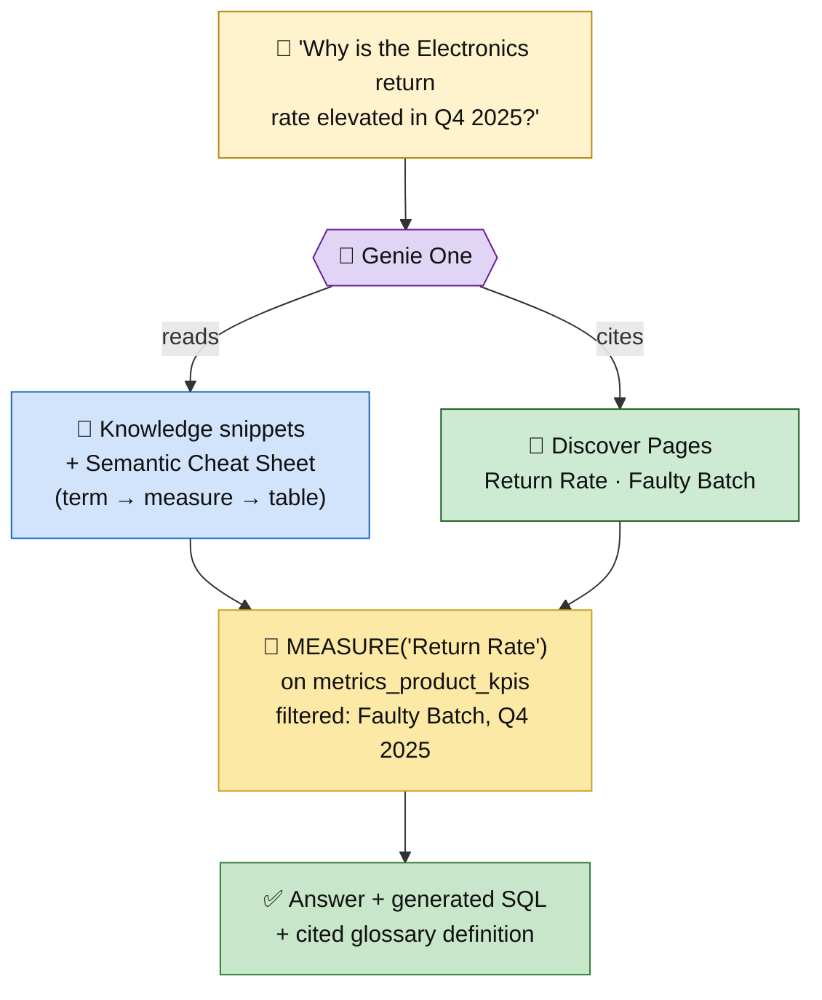
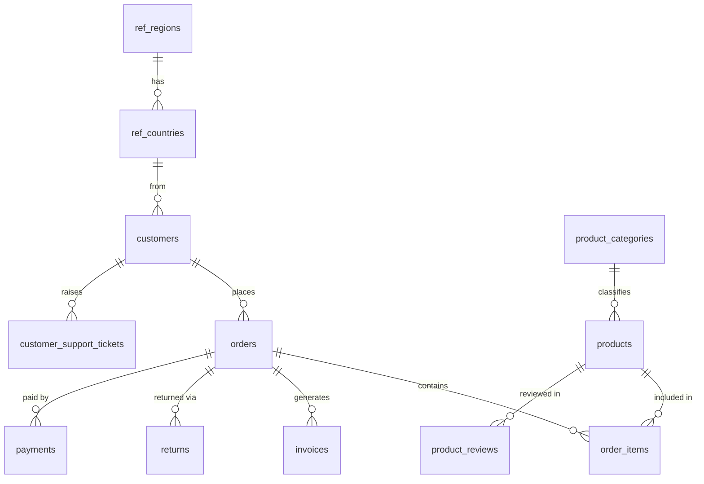

# DQ_UC_Ontology — Databricks Governance, Data Quality & Ontology Demo

> A full-stack Databricks demo on a synthetic global online-retail dataset: a governed
> **medallion pipeline** → **Unity Catalog governance** → a **metric-view semantic layer** →
> a **Discover ontology (domains + a 30-term business glossary)** that makes **Genie One**
> answer business questions in plain English — and cite where the answer came from.

**Deployable to any workspace** — no hardcoded URLs/IDs. Configure `databricks.local.yml` once, run 6 steps.

```mermaid
flowchart LR
    RAW["📁 Raw<br/>20 Parquet tables<br/>UC Volume"] --> BRZ["🥉 Bronze<br/>18 streaming tables<br/>Auto Loader"]
    BRZ --> SLV["🥈 Silver<br/>8 datasets<br/>DQX + PII masks"]
    SLV --> GLD["🥇 Gold<br/>6 materialized views"]
    GLD --> MET["📐 Metrics<br/>3 metric views + 3 MVs<br/>semantic layer"]
    MET --> GEN["🧠 Genie One<br/>NL analytics"]
    ONT["📖 Discover Ontology<br/>4 domains · 30-term glossary"] -. "authoritative context" .-> GEN
    MET -. "backs" .-> ONT

    classDef raw fill:#ECEFF1,stroke:#607D8B,color:#111
    classDef bronze fill:#F3D9B1,stroke:#A9743B,color:#111
    classDef silver fill:#E0E4E7,stroke:#78909C,color:#111
    classDef gold fill:#FCE9A6,stroke:#C9A227,color:#111
    classDef metrics fill:#D2E3FC,stroke:#1565C0,color:#111
    classDef genie fill:#E1D5F5,stroke:#6A1B9A,color:#111
    classDef onto fill:#CDEBD3,stroke:#1B5E20,color:#111
    class RAW raw
    class BRZ bronze
    class SLV silver
    class GLD gold
    class MET metrics
    class GEN genie
    class ONT onto
```



| Layer | What you get |
|---|---|
| **Pipeline** | Lakeflow SDP — 18 bronze streaming tables → 8 silver datasets → 6 gold MVs (32 Delta tables) |
| **Data quality** | Native SDP expectations + rule-driven `databricks-labs-dqx` **per-entity quarantine** tables (`<source_table>_quarantine`) rolled up into one view (139 records caught) |
| **Governance** | UC column masks (PII), tags, table/column comments, grants — on all 32 tables |
| **Semantic layer** | 3 governed metric views (`WITH METRICS LANGUAGE YAML`) + 3 UC materialized views |
| **Ontology** | `Online Retail` domain + 3 subdomains + a **30-term business glossary** for Genie |
| **Genie One** | NL space wired to the metric views, with knowledge snippets + verified example SQL |

---

## The Business Story

**NexusRetail** — a global e-commerce platform: **173 products** · 12 categories · **65 countries** · 7 regions · **600 customers** · 24 months (Sep 2024 – Sep 2026).

> 🎯 **The embedded narrative:** In **Q3 2025** a batch of **8 defective smartphones** (`FAULT-PHON-*`) shipped to customers. **Q4 2025** saw a **return spike** — 78 of 120 total returns — concentrated in **APAC-East**. The DQ framework surfaces it, the quarantine captures it, and Genie explains *"why is the return rate elevated?"* in natural language.

Plus three seeded data-quality issues that the DQX framework catches (**139 quarantined records** total):

| Issue | Where | Count | Action |
|---|---|---|---|
| NULL `invoice_total` | `bronze_invoices` | ~52 | **Dropped** at silver (`@dp.expect_or_drop`) + quarantined |
| Failed payments | `bronze_payments` | ~43 | Quarantined (warn) |
| Duplicate emails | `bronze_customers` | 3 | Quarantined (warn) |
| Faulty-product returns | `bronze_returns` | 41 | Quarantined (warn) |

---

## How Genie uses the Ontology

This is the point of the repo: business questions resolve to the **exact** metric-view measure, and the ontology Page is cited as the source.



Every glossary Page carries **definition · how it's calculated (exact `MEASURE()`/column) · where it lives (MV + grain) · benchmarks · the questions it answers · related terms**. Built by `setup/03_domains_setup.py` into a bulk-import file; the Genie space snippets in `setup/02_genie_setup.py` mirror the same definitions.

<details>
<summary><b>The 30-term glossary, by domain</b></summary>

| Subdomain | Glossary terms |
|---|---|
| **Sales Performance** | Gross Revenue · Net Revenue · Average Order Value · Order Count · Units Sold · Total Discount · Sales Channel · New vs Returning Customer · Revenue per Customer · Q4 Seasonal Peak |
| **Customer Analytics** | Customer Lifetime Value · CLV Segment · Loyalty Tier · Repeat Purchase Rate · Acquisition Channel · Customer Type (B2C/B2B) · Demographic Segments |
| **Returns & Quality** | Return Rate · Faulty Batch (FAULT-PHON-\*) · Q4 2025 Return Spike · Return Reason · Total Refund Amount · Avg Days to Return · Cancellation Rate · DQ Quarantine |
| **Cross-domain** | Region & Country Hierarchy · Product Category Taxonomy · Fiscal Calendar · PII Masking & GDPR · Medallion Layers |

</details>

---

## Data Model

20 source tables across 5 domains → Spark + Faker → Parquet in a UC Volume.



<details>
<summary><b>All 20 source tables (rows + purpose)</b></summary>

**Reference** — `ref_regions` (7) · `ref_countries` (65, ISO/currency/language)
**Product** — `product_categories` (12) · `product_subcategories` (50) · `products` (173; 8 `FAULT-PHON-*` = defective batch) · `product_pricing` (~371 price-history rows)
**Customer (PII)** — `customers` (600; name/email/phone/DOB) · `customer_demographics` (600; income, age, loyalty, NPS) · `customer_addresses` (~800)
**Transaction** — `orders` (1,200; Q4 seasonal spike) · `order_items` (~3,194) · `invoices` (1,064; ~52 NULL totals) · `invoice_line_items` (~2,832) · `payments` (1,200; ~43 failed) · `returns` (120; 78 in Q4 2025; 41 faulty) · `return_items` (~146)
**Enrichment** — `promotions` (30) · `promotion_redemptions` (600) · `product_reviews` (2,000) · `customer_support_tickets` (1,500; 3× Q4-2025 spike)

</details>

---

## Pipeline & Semantic Layer

<details>
<summary><b>Bronze → Silver → Gold (32 Delta tables)</b></summary>

**Bronze** (`online_retail_bronze`) — 18 Auto Loader streaming tables; PK `@dp.expect_or_fail`; Liquid Clustering. `bronze_products` sets the `faulty_batch` flag + `FAULT-PHON-*` SKUs at ingest.

**Silver** (`online_retail_silver`) — 8 datasets:

| Dataset | Type | Key logic |
|---|---|---|
| `<source_table>_quarantine` ×8 | MV | **Per-entity DQX quarantine** — one table per bronze entity (`bronze_customers_quarantine`, `bronze_invoices_quarantine`, …) holding only that entity's failing/flagged records |
| `silver_dq_quarantine` | MV | Combined roll-up — `UNION` over the 8 per-entity quarantine tables |
| `silver_dq_summary` | MV | Failing-record counts per (source_table, dq_rule, severity) |
| `silver_dim_date` / `silver_dim_geography` | MV | Date spine · country→region→super-region |
| `silver_dim_products` | ST | Flattened category hierarchy + current price |
| `silver_dim_customers` | ST | Auto CDC SCD-1 + demographics; **PII masks** |
| `silver_fact_orders` | ST | Customer + geography enrichment |
| `silver_fact_invoices` | ST | **~52 NULL-total rows dropped** |
| `silver_fact_returns` | ST | Product + `faulty_batch` enrichment |

**Gold** (`online_retail_gold`) — 6 materialized views (`CLUSTER BY AUTO`):
`gold_category_sales` · `gold_customer_segment_sales` · `gold_regional_performance` · `gold_customer_lifetime_value` · `gold_return_analysis` · `gold_daily_revenue`.

</details>

**Metrics** (`online_retail_metrics`) — the certified semantic layer Genie queries:

| Metric view | Source | Slice by | Key measures |
|---|---|---|---|
| `metrics_sales_kpis` | `gold_daily_revenue` | month/quarter/week, channel, region | Gross Revenue, Order Count, Avg Order Value, New/Returning Customer |
| `metrics_customer_kpis` | `mv_customer_demo_sales` | age, income, loyalty, acquisition, B2C/B2B | Revenue, Repeat Purchase Rate, Revenue per Customer |
| `metrics_product_kpis` | `gold_return_analysis` | category, return reason, faulty batch | Return Rate, Total Refund, Avg Days to Return |

Measures use `MEASURE()`; stored columns (Net Revenue, Units Sold, Cancellation Rate) use `SUM()`/`AVG()`. Plus 3 UC MVs: `mv_category_revenue`, `mv_customer_demo_sales`, `mv_regional_orders`.

---

## Governance

```
<catalog>
├── online_retail_raw      source Parquet (UC Volume)
├── online_retail_bronze   Auto Loader streaming tables (PII present)
├── online_retail_silver   cleansed · PII masked · DQX validated
├── online_retail_gold      aggregated · no PII
└── online_retail_metrics   semantic layer (metric views + MVs) · Genie source
```

- **PII column masks** on `silver_dim_customers` — non-owner sees `G***`, `***@domain.com`, `***-***-1234`, year-only DOB; the catalog owner sees raw values (GDPR data-minimisation).
- **UC tags** on every table/column — `quality_tier`, `domain`, `contains_pii`, `pii_classification`, `regulatory`, `data_product`, plus the governed **domain tags** (`online_retail` + 3 subdomains) that bind tables to Discover domains.
- **Comments** — grain, measures, DQ notes, and lineage on every table; mask rule + GDPR basis on every PII column.

---

## Deploy in 6 steps

**Step 0 — configure** (no hardcoded values; `databricks.local.yml` is gitignored):

```bash
cp databricks.local.yml.example databricks.local.yml
# edit: host, profile, catalog (must exist), warehouse_id, owner_user (gets unmasked PII)
```

| # | Command | Creates | ~Time |
|---|---|---|---|
| 1 | `databricks bundle deploy -t dev` | pipeline + 5 jobs, uploads notebooks | ~1 min |
| 2 | `databricks bundle run nexus_retail_generate_data -t dev` | 20 raw Parquet tables (~15K rows) | ~20 min |
| 3 | `databricks bundle run nexus_retail_pipeline -t dev` | 32 Delta tables + 139-record quarantine | ~3 min |
| 4 | `databricks bundle run nexus_retail_governance -t dev` | masks, tags, comments, metric views, **domain tags** | ~2 min |
| 5 | `databricks bundle run nexus_retail_genie_setup -t dev` | Genie space + snippets + example SQL | ~1 min |
| 6 | `databricks bundle run nexus_retail_domains -t dev` | domains + **glossary Pages** bulk-import file | ~1 min |

**After Step 6:** open **Discover ▸ Pages ▸ Create page ▸ Genie Code ▸ Bulk import pages**, attach the generated `nexus_retail_pages.md`, review, and **Publish** — published Pages become authoritative context Genie prioritises and cites.

<details>
<summary><b>Prerequisites & gotchas</b></summary>

- **Prereqs:** Databricks CLI ≥ v1.0.0 · authenticated profile · an existing UC catalog · a running SQL warehouse.
- **Step 6 (account-admin, one-time):** enable the **Domains and Discover Page** previews; runner needs `MANAGE DISCOVERY` + `APPLY TAG`. Domains are account-level and capped (300) — if at cap, domain creation is skipped with guidance but the tags + Pages file are still produced. Pages have no public create API (Beta) → the bulk-import file is the supported path.
- **Switching workspaces:** `rm -rf .databricks/` (stale Terraform state) before redeploying.
- **`workspace_id mismatch`:** remove any explicit `workspace_id` line from your `~/.databrickscfg` profile.

</details>

<details>
<summary><b>Troubleshooting</b></summary>

| Symptom | Fix |
|---|---|
| `variable 'catalog'/'owner_user' is required` | `cp databricks.local.yml.example databricks.local.yml` and fill values |
| `workspace_id mismatch` on deploy | delete the `workspace_id = ...` line in `~/.databrickscfg` |
| `Error: resource not found` on deploy | `rm -rf .databricks/` then redeploy |
| Governance tags fail `INVALID_PARAMETER_VALUE` | tag key not pre-registered — apply via Catalog Explorer → Tags |
| Column comment fails on gold/metrics | expected — `ALTER COLUMN` unsupported on MVs; script skips them |
| Domain create `RESOURCE_EXHAUSTED` (300 cap) | free domain slots or raise account limit, then re-run Step 6 |
| Pages have no "create" API | use the generated bulk-import file (Discover ▸ Pages ▸ Genie Code) |

</details>

---

## Demo Walkthrough

Replace `<catalog>` with your catalog. More verified queries live in `setup/02_genie_setup.py`.

```sql
-- 1. Data quality: the quarantine story (expect ~139 rows across the rules)
SELECT source_table, dq_rule, severity, COUNT(*) AS record_count
FROM <catalog>.online_retail_silver.silver_dq_quarantine
GROUP BY ALL ORDER BY severity, dq_rule;

-- 1b. Per-entity triage: inspect just the customer quarantine
SELECT dq_rule, severity, record_key, detail
FROM <catalog>.online_retail_silver.bronze_customers_quarantine;

-- 2. The return anomaly: faulty batch vs normal, from Q3 2025
SELECT `Return Month`, `Faulty Batch`, MEASURE(`Return Rate`) AS return_rate
FROM <catalog>.online_retail_metrics.metrics_product_kpis
WHERE `Return Month` >= DATE '2025-07-01'
GROUP BY ALL ORDER BY ALL;

-- 3. Semantic layer: repeat purchase rate by loyalty tier
SELECT `Loyalty Tier`, MEASURE(`Repeat Purchase Rate`) AS repeat_rate
FROM <catalog>.online_retail_metrics.metrics_customer_kpis
GROUP BY ALL ORDER BY repeat_rate DESC;
```

**Then ask Genie** (NexusRetail Analytics space):
> *"Why is the Electronics return rate elevated in Q4 2025?"* · *"Which loyalty tier has the highest repeat purchase rate?"* · *"Compare Q4 2025 vs Q4 2024 revenue by region"*

---

## Project Structure

```
DQ_UC_Ontology/
├── databricks.yml                  # DAB bundle — pipeline + 5 jobs (no hardcoded values)
├── databricks.local.yml.example    # copy → databricks.local.yml, fill 3 values
├── dqx_rules/silver_rules.yaml      # DQX rule registry (rule-driven quarantine)
├── src/
│   ├── bronze_layer.py             # 18 Auto Loader streaming tables
│   ├── silver_layer.py             # DQ quarantine + 7 silver datasets (+ PII masks)
│   └── gold_layer.py               # 6 gold materialized views
├── governance/
│   ├── run_governance.py           # ★ masks, tags, comments, metric views, domain tags
│   └── *.sql                        # reference DDL (masks / tags / metric views)
└── setup/
    ├── 01_generate_raw_data.py     # 20 Parquet tables via Spark + Faker
    ├── 02_genie_setup.py           # ★ Genie space, snippets, example SQL
    └── 03_domains_setup.py         # ★ Discover domains + 30-term glossary Pages file
```

| Job | Notebook | Order |
|---|---|---|
| `nexus_retail_generate_data` | `setup/01_generate_raw_data.py` | 1 |
| `nexus_retail_pipeline` | `src/{bronze,silver,gold}_layer.py` | 2 |
| `nexus_retail_governance` | `governance/run_governance.py` | 3 |
| `nexus_retail_genie_setup` | `setup/02_genie_setup.py` | 4 |
| `nexus_retail_domains` | `setup/03_domains_setup.py` | 5 |

---

## Tech Stack

Lakeflow SDP (Auto Loader · streaming tables · materialized views · Auto CDC) · `databricks-labs-dqx` + native `@dp.expect*` · Unity Catalog (column masks · tags · comments · Discover domains & Pages) · UC Metric Views · Genie One · Databricks Asset Bundles · Spark + Faker · Delta Lake — all on **Serverless**.
