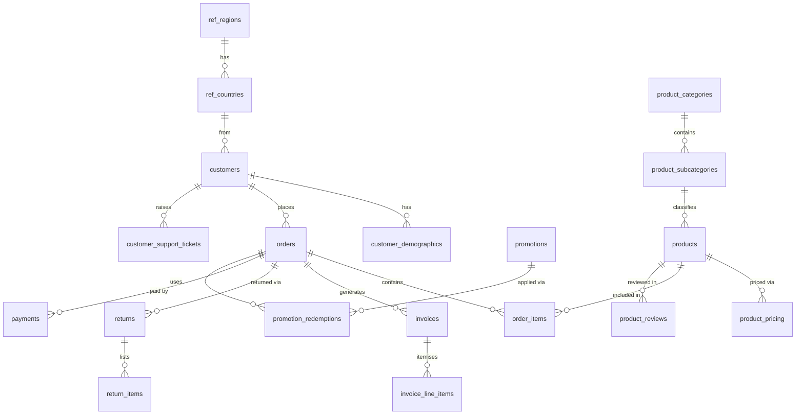

# DQ_UC_Ontology — Databricks Data Governance & Quality Demo

A full-stack Databricks demonstration of **data governance**, **data quality**, and **ontology-driven analytics** built on a synthetic global online retail dataset. The solution spans the complete Databricks data platform: Lakeflow Spark Declarative Pipelines (SDP), Unity Catalog governance, metric views, and Genie One natural language analytics.

**Workspace:** `e2-demo-field-eng.cloud.databricks.com`  
**Catalog:** `gurpreet_sethi`  
**Pipeline:** `NexusRetail Analytics Pipeline` (`d8de9ffb-3723-4d56-a65c-e3d183c7caf8`)

---

## Contents

- [The Business Story](#the-business-story)
- [Architecture Overview](#architecture-overview)
- [Data Model](#data-model)
- [Pipeline — Bronze → Silver → Gold](#pipeline--bronze--silver--gold)
- [Data Quality Framework](#data-quality-framework)
- [Unity Catalog Governance](#unity-catalog-governance)
- [Metric Views — Semantic Layer](#metric-views--semantic-layer)
- [Genie One Setup](#genie-one-setup)
- [Deployment Guide](#deployment-guide)
- [Demo Walkthrough](#demo-walkthrough)
- [Project Structure](#project-structure)

---

## The Business Story

**NexusRetail** is a global e-commerce platform selling 173 products across 12 categories, 65 countries, and 7 regions. The dataset covers 24 months (September 2024 – September 2026) and has a deliberate narrative embedded in the data:

> *In Q3 2025 (July–September), a batch of 8 defective Smartphone units (SKUs prefixed `FAULT-PHON-*`, `product_idx` 4–11) were shipped to customers. Q4 2025 saw a return spike — 78 of 120 total returns occurred in October–December 2025. DQX-style quality checks surface these anomalies, the DQ quarantine table captures them, and the Metric Views enable Genie to answer "why is the return rate elevated?" in natural language.*

Three additional data quality issues are intentionally embedded to demonstrate the DQX framework:

| Issue | Location | Count | DQX Rule | Action |
|---|---|---|---|---|
| NULL `invoice_total` | `bronze_invoices` | ~52 rows | `invoice_total_null` (error) | **Dropped** at silver layer via `@dp.expect_or_drop` |
| Duplicate emails | `bronze_customers` | 3 rows | `duplicate_email` (warn) | Quarantined in `silver_dq_quarantine` |
| Failed payments | `bronze_payments` | ~43 rows | `failed_payment` (warn) | Quarantined in `silver_dq_quarantine` |

---

## Architecture Overview

```mermaid
flowchart LR
    subgraph RAW["📁 UC Volume — online_retail_raw"]
        direction TB
        V["/Volumes/gurpreet_sethi\n/online_retail_raw/raw_data/\n20 Parquet tables"]
    end

    subgraph BRONZE["🥉 online_retail_bronze"]
        direction TB
        B1[bronze_orders\nStreaming Table]
        B2[bronze_customers\nStreaming Table]
        B3[bronze_invoices\nStreaming Table]
        B4["bronze_products\n(faulty_batch corrected)"]
        B5["... 14 more\nStreaming Tables"]
    end

    subgraph SILVER["🥈 online_retail_silver"]
        direction TB
        S1[silver_fact_orders\nStreaming Table + DQX]
        S2["silver_dim_customers\nAuto CDC SCD-1\nPII masked 🔒"]
        S3["silver_fact_invoices\n52 NULL rows dropped"]
        S4[silver_fact_returns\nfaulty_batch enriched]
        S5["silver_dq_quarantine\n139 records caught"]
    end

    subgraph GOLD["🥇 online_retail_gold"]
        direction TB
        G1[gold_category_sales\nMV]
        G2[gold_customer_segment_sales\nMV]
        G3[gold_regional_performance\nMV]
        G4[gold_customer_lifetime_value\nMV]
        G5[gold_return_analysis\nMV]
        G6[gold_daily_revenue\nMV]
    end

    subgraph METRICS["📐 online_retail_metrics"]
        direction TB
        M1[mv_category_revenue\nUC MV]
        M2[mv_customer_demo_sales\nUC MV]
        M3[mv_regional_orders\nUC MV]
        MV1[metrics_sales_kpis\nMetric View YAML]
        MV2[metrics_customer_kpis\nMetric View YAML]
        MV3[metrics_product_kpis\nMetric View YAML]
    end

    subgraph GENIE["🧠 Genie One"]
        G_S[Sales Performance]
        G_C[Customer Analytics]
        G_R[Returns & Quality]
    end

    V -->|Auto Loader\ncloudFiles| BRONZE
    BRONZE -->|DQX checks\n+ SDP expectations| SILVER
    SILVER -->|Materialized\nViews| GOLD
    GOLD --> METRICS
    METRICS --> GENIE
```



---

## Data Model

20 source tables across 5 domains, generated with Spark + Faker and stored as Parquet in a Unity Catalog Volume.

### Reference Domain
| Table | Rows | Description |
|---|---|---|
| `ref_regions` | 7 | Global regions (AMER-North, AMER-South, EMEA-West, EMEA-East, APAC-East, APAC-South, MENA) |
| `ref_countries` | 65 | Countries with region FK, ISO codes, currency, language |

### Product Domain
| Table | Rows | Description |
|---|---|---|
| `product_categories` | 12 | Electronics, Apparel, Home & Living, Sports, Beauty, Books, Toys, Food, Automotive, Garden, Pet, Office |
| `product_subcategories` | 50 | 4–5 subcategories per category |
| `products` | 173 | SKU, brand, category FK. 8 products (`FAULT-PHON-0004` → `FAULT-PHON-0011`) are the defective batch |
| `product_pricing` | ~371 | Price history: 1–3 records per product with `effective_from`/`effective_to` dates |

### Customer Domain (PII)
| Table | Rows | PII Columns |
|---|---|---|
| `customers` | 600 | `full_name`, `email`, `phone`, `date_of_birth` |
| `customer_demographics` | 600 | `annual_income_usd`, age bracket, income bracket, loyalty tier, NPS |
| `customer_addresses` | ~800 | `address_line1`, `postcode` (shipping + billing) |

### Transaction Domain
| Table | Rows | Description |
|---|---|---|
| `orders` | 1,200 | 24 months, Q4 seasonal spike. Status: delivered/shipped/confirmed/cancelled/pending |
| `order_items` | ~3,194 | 2–4 items per order with unit price, quantity, discount |
| `invoices` | 1,064 | One per confirmed/shipped/delivered order. ~52 intentionally have NULL `invoice_total` |
| `invoice_line_items` | ~2,832 | 2–3 items per invoice, with tax (electronics 10%, food 0%, others 8%) |
| `payments` | 1,200 | One per order. ~43 have `payment_status='failed'` |
| `returns` | 120 | 78 occurred in Q4 2025. 41 have `return_reason_code='faulty_product'` |
| `return_items` | ~146 | 1–2 items per return with condition assessment |

### Enrichment Domain
| Table | Rows | Description |
|---|---|---|
| `promotions` | 30 | Percentage off, buy-X-get-Y, free shipping, bundle deals, flash sales |
| `promotion_redemptions` | 600 | Orders × promotions applied |
| `product_reviews` | 2,000 | Star ratings 1–5 with verified purchase flag |
| `customer_support_tickets` | 1,500 | 3× volume spike in Q4 2025 (faulty batch escalations) |

### Entity Relationship (simplified)



---

## Pipeline — Bronze → Silver → Gold

The SDP pipeline (`src/bronze_layer.py`, `src/silver_layer.py`, `src/gold_layer.py`) implements the full medallion architecture on Databricks Serverless compute.

### Bronze Layer (`online_retail_bronze`)

18 **Streaming Tables** read from Parquet files via Auto Loader (`cloudFiles` format). Each table:
- Adds metadata columns: `_ingestion_time`, `_source_file`, `_pipeline_env`
- Applies `@dp.expect_or_fail` on primary key columns (pipeline fails if PK is null)
- Uses **Liquid Clustering** on natural access patterns (e.g. `order_id + order_date`)

Special handling on `bronze_products`: the `faulty_batch` flag and `FAULT-PHON-*` SKU prefixes are set by a business rule correction applied at ingest time (the raw generation had an index offset):

```python
.withColumn("faulty_batch",
    F.when(F.col("product_idx").between(4, 11), F.lit(True)).otherwise(F.lit(False)))
.withColumn("sku",
    F.when(F.col("product_idx").between(4, 11),
           F.concat(F.lit("FAULT-PHON-"), F.lpad(F.col("product_idx").cast("string"), 4, "0")))
     .otherwise(F.col("sku")))
```

### Silver Layer (`online_retail_silver`)

8 datasets combining **Streaming Tables**, **Materialized Views**, and a DQ quarantine MV:

| Dataset | Type | Key Logic |
|---|---|---|
| `silver_dq_quarantine` | MV | Explicit bad-record capture: NULL invoices + dup emails + failed payments + faulty returns |
| `silver_dim_date` | MV | Date spine Sep 2024–Dec 2027 with fiscal quarter, is_q4 flags |
| `silver_dim_geography` | MV | Denormalised country → region with continent code |
| `silver_dim_products` | Streaming Table | Flattened category hierarchy + current price from pricing history |
| `silver_dim_customers` | Streaming Table | Auto CDC SCD-1 + demographics join. PII column masks applied post-pipeline |
| `silver_fact_orders` | Streaming Table | Customer + geography enrichment. `computed_total` vs `order_total` reconciliation |
| `silver_fact_invoices` | Streaming Table | **~52 rows DROPPED** by `@dp.expect_or_drop("invoice_total not null")` |
| `silver_fact_returns` | Streaming Table | Product + faulty_batch enrichment. `faulty_batch_involved` flag per return |

**SDP Native Expectations (selected):**

```python
# silver_fact_orders
@dp.expect_or_drop("order_id not null",   "order_id IS NOT NULL")
@dp.expect("order_total positive",        "order_total > 0")
@dp.expect("total matches items",         "ABS(order_total - computed_total) <= 0.01")
@dp.expect("valid status",
           "status IN ('delivered','shipped','confirmed','cancelled','pending')")

# silver_fact_invoices — the key DQX-story check
@dp.expect_or_drop("invoice_total not null", "invoice_total IS NOT NULL")
```

### Gold Layer (`online_retail_gold`)

6 **Materialized Views** aggregating from silver, with `CLUSTER BY AUTO` for adaptive data layout:

| Table | Grain | Key Measures |
|---|---|---|
| `gold_category_sales` | category × subcategory × region × month | gross/net revenue, return_rate_pct, total_discount |
| `gold_customer_segment_sales` | age_bracket × income_bracket × loyalty_tier × region × month | revenue, repeat_purchase_rate_pct, revenue_per_customer |
| `gold_regional_performance` | region × country × month | gross/net revenue, return_rate_pct, cancellation_rate_pct |
| `gold_customer_lifetime_value` | customer_id | total_revenue, clv_segment (High/Medium/Low/Churned), orders_per_30_days |
| `gold_return_analysis` | product × return_reason × week | return_count, return_rate_pct, avg_days_to_return |
| `gold_daily_revenue` | date × channel × region | gross_revenue, new_customers, returning_customers |

---

## Data Quality Framework

Quality checks are implemented at two levels:

### 1. Native SDP Expectations (pipeline-enforced)

Violations appear in the **Pipeline UI** as expectation metrics. Three enforcement modes:

| Mode | Decorator | Behaviour |
|---|---|---|
| Warn | `@dp.expect` | Row kept, violation counted and visible in pipeline graph |
| Drop | `@dp.expect_or_drop` | Row excluded from silver table |
| Fail | `@dp.expect_or_fail` | Pipeline update fails on first violation |

### 2. DQ Quarantine MV (`silver_dq_quarantine`)

An explicit Materialized View that captures all records failing critical checks across the pipeline. 139 records currently in quarantine:

```
source_table       | dq_rule                  | severity | count
-------------------|--------------------------|----------|------
bronze_invoices    | invoice_total_null       | error    | ~52
bronze_payments    | failed_payment           | warn     | ~43
bronze_returns     | high_return_rate_product | warn     | 41
bronze_customers   | duplicate_email          | warn     | 3
```

Rules are documented in `dqx_rules/silver_rules.yaml` using the [databricks-labs-dqx](https://databrickslabs.github.io/dqx/) schema — this file serves as the authoritative rule registry for governance and audit purposes.

### Quality Metrics Summary

```
bronze_orders         →  silver_fact_orders        1,200 / 1,200  (0 dropped)
bronze_invoices       →  silver_fact_invoices       1,012 / 1,064  (52 dropped — NULL total)
bronze_returns        →  silver_fact_returns          120 / 120    (0 dropped)
silver_dq_quarantine  →  total flagged records         139
```

---

## Unity Catalog Governance

### Schema Hierarchy

```
gurpreet_sethi (catalog)
├── online_retail_raw       ← source Parquet in /Volumes/.../raw_data/
├── online_retail_bronze    ← Auto Loader streaming tables (PII present)
├── online_retail_silver    ← Cleansed, PII masked, DQX validated
├── online_retail_gold      ← Aggregated, no PII
└── online_retail_metrics   ← Semantic layer (UC MVs + Metric Views)
```

### PII Column Masks

Applied to `silver_dim_customers` via Unity Catalog column mask functions. Non-owner users see masked values; `gurpreet.sethi@databricks.com` sees raw values.

| Column | Non-owner sees | Owner sees |
|---|---|---|
| `full_name` | `G***` (first initial + `***`) | `Gurpreet Singh Sethi` |
| `email` | `***@databricks.com` | `gurpreet.sethi@databricks.com` |
| `phone` | `***-***-1234` | `+61 2 9876 1234` |
| `date_of_birth` | `1980-01-01` (year only) | `1980-07-15` |

Mask functions live in `online_retail_silver` schema:
```sql
SELECT full_name, email FROM gurpreet_sethi.online_retail_silver.silver_dim_customers LIMIT 5;
-- As non-owner: G***, ***@gmail.com
-- As owner:     Gurpreet Singh Sethi, gurpreet.sethi@example.com
```

### UC Tags Applied

| Tag Key | Values | Applied to |
|---|---|---|
| `quality_tier` | `bronze`, `silver`, `gold` | All tables |
| `domain` | `customer`, `product`, `transaction`, `geography`, `data_quality` | All tables |
| `contains_pii` | `true` | bronze/silver customer tables |
| `pii_classification` | `direct`, `quasi`, `sensitive_financial` | PII columns |
| `regulatory` | `gdpr` | Customer-domain tables |
| `data_product` | `nexus_retail` | All tables |
| `faulty_batch` | SKU-level quality indicator | `bronze_products.faulty_batch` column |
| `key_story` | `faulty_batch_return_anomaly`, `apac_east_return_spike` | Gold return/regional tables |

> **Note:** Some workspace-level tag keys require pre-registration by an account admin. The full tag list is in `governance/02_tags_and_comments.sql`. Tags successfully applied at runtime are listed above; remaining tags can be applied via Catalog Explorer UI → Tags.

### Table and Column Comments

Every table has a `COMMENT` covering: grain, key measures, data quality notes, and lineage context. Every PII column has a comment explaining the mask rule and GDPR basis. Run `governance/02_tags_and_comments.sql` to apply all comments.

### Access Control

```sql
-- Owner: full access, unmasked PII
GRANT USE CATALOG ON CATALOG gurpreet_sethi    TO `gurpreet.sethi@databricks.com`;
GRANT SELECT      ON SCHEMA online_retail_gold TO `gurpreet.sethi@databricks.com`;

-- Analytics team (add after creating group): masked silver + gold + metrics
-- GRANT USE SCHEMA ON SCHEMA online_retail_gold    TO `analytics-team`;
-- GRANT SELECT     ON SCHEMA online_retail_metrics TO `analytics-team`;
-- Note: silver_dim_customers shows masked PII via column masks for this group
```

---

## Metric Views — Semantic Layer

Three `WITH METRICS LANGUAGE YAML` views in `online_retail_metrics` provide a governed semantic layer. Dimensions are sliced at query time; measures use the `MEASURE()` function to prevent re-aggregation errors on ratios.

### `metrics_sales_kpis`
Source: `gold_daily_revenue`

| Dimensions | Measures |
|---|---|
| Sale Month, Sale Quarter, Channel, Region, Super Region | Gross Revenue, Order Count, Avg Order Value, Unique Customers, New Customers, Returning Customers |

```sql
SELECT `Sale Month`, `Region`, MEASURE(`Gross Revenue`) AS revenue
FROM gurpreet_sethi.online_retail_metrics.metrics_sales_kpis
WHERE YEAR(`Sale Month`) = 2025
GROUP BY ALL ORDER BY ALL;
```

### `metrics_customer_kpis`
Source: `mv_customer_demo_sales`

| Dimensions | Measures |
|---|---|
| Age Bracket, Income Bracket, Loyalty Tier, Acquisition Channel, Region, Month | Revenue, Customer Count, Avg Order Value, Repeat Purchase Rate |

### `metrics_product_kpis`
Source: `gold_return_analysis`

| Dimensions | Measures |
|---|---|
| Category, Subcategory, Return Reason, Faulty Batch, Return Month | Return Count, Total Refund, Return Rate |

---

## Genie One Setup

Three domain pages in the "NexusRetail Analytics" Genie space, backed by metric views.

### Data Sources

```
gurpreet_sethi.online_retail_metrics.mv_category_revenue
gurpreet_sethi.online_retail_metrics.mv_customer_demo_sales
gurpreet_sethi.online_retail_metrics.mv_regional_orders
gurpreet_sethi.online_retail_metrics.metrics_sales_kpis
gurpreet_sethi.online_retail_metrics.metrics_customer_kpis
gurpreet_sethi.online_retail_metrics.metrics_product_kpis
gurpreet_sethi.online_retail_gold.gold_daily_revenue
gurpreet_sethi.online_retail_gold.gold_return_analysis
gurpreet_sethi.online_retail_gold.gold_customer_lifetime_value
```

### Pages & Sample Questions

**📊 Sales Performance**
- "What were the top 5 categories by revenue in Q4 2025?"
- "Show me weekly revenue trend for APAC-East in 2025"
- "Which channel — web, mobile, or partner API — drives the highest average order value?"

**👥 Customer Analytics**
- "Which income bracket has the highest customer lifetime value?"
- "What is the repeat purchase rate for Platinum vs Bronze loyalty tier?"
- "Which age group churned most in Q3 2025?"

**↩️ Returns & Quality**
- "Why is the Electronics return rate elevated in Q4 2025?"
- "Show return rate by product SKU — which products have a rate above 20%?"
- "How many support tickets were raised for product defects in Q4 2025?"

### Automated Setup

Upload `setup/02_genie_setup.py` as a Databricks workspace notebook and run it — it creates the Genie space, adds data sources, and populates 8 knowledge snippets that pre-wire domain semantics (metric definitions, return rate thresholds, faulty batch context, date conventions, region hierarchy).

---

## Deployment Guide

### Prerequisites

- Databricks CLI ≥ v1.0.0 (`databricks --version`)
- An active CLI profile authenticated to your target workspace (`databricks auth profiles`)
- A Unity Catalog **catalog** that already exists (your user catalog is fine)
- A running **SQL warehouse** — find the ID in Workspace → SQL Warehouses → `<name>` → Connection Details (last path segment after `/warehouses/`)
- `databricks-sdk` Python package installed (`pip install databricks-sdk`)

### Step 0 — Configure Your Workspace

The bundle has **no hardcoded workspace URL or IDs**. Create your local config file from the provided template:

```bash
cp databricks.local.yml.example databricks.local.yml
```

Edit `databricks.local.yml` with your values:

```yaml
targets:
  dev:
    workspace:
      host: https://YOUR-WORKSPACE.cloud.databricks.com
    variables:
      catalog: your_catalog_name      # must already exist
      warehouse_id: your_warehouse_id # from SQL Warehouse → Connection Details
```

`databricks.local.yml` is gitignored — it never gets committed. It is merged on top of `databricks.yml` automatically by the CLI.

> **Switching workspaces later?** Delete `.databricks/` (the local bundle Terraform state) before your first deploy on the new workspace. Stale state contains resource IDs from the previous workspace that don't exist in the new one:
> ```bash
> rm -rf .databricks/
> ```

### Step 1 — Validate & Deploy the Bundle

```bash
# --profile is optional if databricks.local.yml sets the host
databricks bundle validate
databricks bundle deploy -t dev
```

The deploy creates the SDP pipeline and data generation job in your workspace. No data is written yet.

### Step 2 — Generate Raw Data (~20 min on serverless)

```bash
databricks bundle run nexus_retail_generate_data -t dev
```

This runs `setup/01_generate_raw_data.py` as a serverless notebook job. It:
1. Creates `online_retail_raw` schema and UC Volume
2. Generates 20 Parquet tables (~15K rows total)
3. Embeds the data quality story (NULL invoices, duplicate emails, faulty batch orders)

Monitor in the **Jobs** UI — the run URL is printed to the CLI output.

### Step 3 — Run the SDP Pipeline (~3 min on serverless)

```bash
databricks bundle run nexus_retail_pipeline -t dev
```

This creates all 32 tables (bronze → silver → gold) including the DQ quarantine MV.

To re-run after data changes:
```bash
# Get pipeline ID from deployment output or the Pipelines UI, then:
databricks pipelines start-update <pipeline_id> --full-refresh
```

> ⚠️ `--full-refresh` reprocesses all source files from scratch. Safe here since the source is static Volume Parquet files, not a live Kafka topic.

### Step 4 — Apply Governance

Update the two variables in `governance/run_governance.py` to match your workspace, then run:

```python
WAREHOUSE  = "your_warehouse_id"   # same as databricks.local.yml
OWNER_USER = "your.email@company.com"
```

```bash
python3 governance/run_governance.py
```

This applies PII column masks, UC tags, table/column comments, and creates the metrics schema with UC MVs and Metric Views.

### Step 5 — Genie One

Upload `setup/02_genie_setup.py` to your workspace as a notebook and run it. For manual setup, follow the guide printed at the end of the notebook.

### Troubleshooting

| Symptom | Cause | Fix |
|---|---|---|
| `Error: resource not found` on deploy | Stale `.databricks/` state from another workspace | `rm -rf .databricks/` then redeploy |
| `variable 'catalog' is required` | `databricks.local.yml` not created | Copy from `.example` and fill in your values |
| `variable 'warehouse_id' is required` | Same as above | Same fix |
| Pipeline fails at `WAITING_FOR_RESOURCES` | Code analysis error — check pipeline events | `databricks pipelines list-pipeline-events <id>` |
| `%pip install` in notebook fails | Not applicable — silver layer uses native SDP expectations only | No action needed |

---

## Demo Walkthrough

### 1. Data Quality — The Quarantine Story

```sql
-- Show the 3 quality issues caught by the quarantine MV
SELECT source_table, dq_rule, severity, COUNT(*) AS record_count
FROM gurpreet_sethi.online_retail_silver.silver_dq_quarantine
GROUP BY 1, 2, 3
ORDER BY 3, 2;
```

Expected output:
```
source_table        dq_rule                    severity  record_count
bronze_invoices     invoice_total_null         error     52
bronze_payments     failed_payment             warn      43
bronze_returns      high_return_rate_product   warn      41
bronze_customers    duplicate_email            warn      3
```

Show the **pipeline graph** in the Databricks UI — the `silver_fact_invoices` node will show `52 rows dropped` on the `invoice_total not null` expectation.

### 2. PII Masking — The Governance Story

```sql
-- As non-owner: masked values
SELECT customer_id, full_name, email, phone, date_of_birth
FROM gurpreet_sethi.online_retail_silver.silver_dim_customers
LIMIT 5;

-- As owner (gurpreet.sethi@databricks.com): raw values
-- Same query, different result — column masks are transparent
```

Navigate to **Catalog Explorer → silver_dim_customers → Columns** to show the lock icons on masked columns with their GDPR basis comments.

### 3. Return Anomaly — The Business Story

```sql
-- Monthly return trend: Q4 2025 spike is visible
SELECT
  DATE_FORMAT(return_week, 'yyyy-MM') AS month,
  CASE WHEN faulty_batch THEN 'FAULT-PHON-* (defective)' ELSE 'Normal Products' END AS product_type,
  SUM(return_count) AS returns,
  ROUND(AVG(return_rate_pct), 1) AS avg_return_rate_pct
FROM gurpreet_sethi.online_retail_gold.gold_return_analysis
WHERE return_week >= DATE '2025-07-01'
GROUP BY 1, 2
ORDER BY 1, 2;
```

### 4. Metric Views — The Semantic Layer Story

```sql
-- Repeat purchase rate by loyalty tier (via metric view)
SELECT `Loyalty Tier`, MEASURE(`Repeat Purchase Rate`) AS repeat_rate
FROM gurpreet_sethi.online_retail_metrics.metrics_customer_kpis
GROUP BY ALL
ORDER BY ALL;

-- Revenue breakdown by region and quarter
SELECT `Sale Quarter`, `Region`, MEASURE(`Gross Revenue`) AS revenue
FROM gurpreet_sethi.online_retail_metrics.metrics_sales_kpis
WHERE YEAR(`Sale Quarter`) IN (2025, 2026)
GROUP BY ALL ORDER BY ALL;
```

### 5. Genie — The Natural Language Story

Open the **NexusRetail Analytics** Genie space and ask:

> *"Why is the Electronics return rate elevated in Q4 2025?"*

Genie queries `metrics_product_kpis` and surfaces the `FAULT-PHON-*` spike. The knowledge snippet about the faulty batch ensures it answers with business context, not just raw numbers.

---

## Project Structure

```
DQ_UC_Ontology/
│
├── databricks.yml                 # DAB bundle config — pipeline + data gen job
│
├── dqx_rules/
│   └── silver_rules.yaml          # 40+ DQ rule definitions (completeness, validity,
│                                  # uniqueness, referential integrity, statistical)
│
├── governance/
│   ├── 01_column_masks.sql        # UC PII mask functions + GRANT statements
│   ├── 02_tags_and_comments.sql   # All UC tags + table/column comments
│   ├── 03_metric_views.sql        # 3 UC MVs + 3 Metric Views (WITH METRICS LANGUAGE YAML)
│   └── run_governance.py          # SDK runner — executes all governance DDL
│
├── setup/
│   ├── 01_generate_raw_data.py    # Databricks notebook: generates 20-table dataset
│   │                              # (~20 min on serverless, uses Spark + Faker)
│   └── 02_genie_setup.py          # Databricks notebook: Genie space + knowledge snippets
│
└── src/
    ├── bronze_layer.py            # 18 Auto Loader Streaming Tables from UC Volume
    ├── silver_layer.py            # DQ quarantine MV + 7 silver datasets (SDP + native expectations)
    └── gold_layer.py              # 6 gold Materialized Views (aggregated, Genie-ready)
```

---

## Key URLs (e2-demo-field-eng workspace)

| Resource | URL |
|---|---|
| Pipeline | `#joblist/pipelines/d8de9ffb-3723-4d56-a65c-e3d183c7caf8` |
| Catalog | `/explore/data/gurpreet_sethi` |
| Silver schema | `/explore/data/gurpreet_sethi/online_retail_silver` |
| DQ Quarantine | `/explore/data/gurpreet_sethi/online_retail_silver/silver_dq_quarantine` |
| Metrics schema | `/explore/data/gurpreet_sethi/online_retail_metrics` |

---

## Technology Stack

| Component | Technology |
|---|---|
| Compute | Databricks Serverless (pipeline + SQL warehouse) |
| Ingestion | Lakeflow SDP — Auto Loader (`cloudFiles` Parquet) |
| Streaming | Spark Structured Streaming via SDP Streaming Tables |
| Batch aggregation | SDP Materialized Views with `CLUSTER BY AUTO` |
| CDC | SDP Auto CDC (SCD Type 1) for `silver_dim_customers` |
| Data quality | Native SDP `@dp.expect*` + explicit DQ quarantine MV |
| DQ rules registry | `databricks-labs-dqx` YAML schema (`dqx_rules/`) |
| Storage format | Delta Lake (all pipeline tables), Parquet (raw volumes) |
| Governance | Unity Catalog column masks, UC tags, table/column comments |
| Semantic layer | UC Metric Views (`WITH METRICS LANGUAGE YAML`) |
| Analytics | UC Materialized Views on gold layer |
| NL querying | Genie One with knowledge snippets |
| Orchestration | Databricks Asset Bundles (DABs) |
| Data generation | Apache Spark + `faker` Python library (serverless notebook) |
